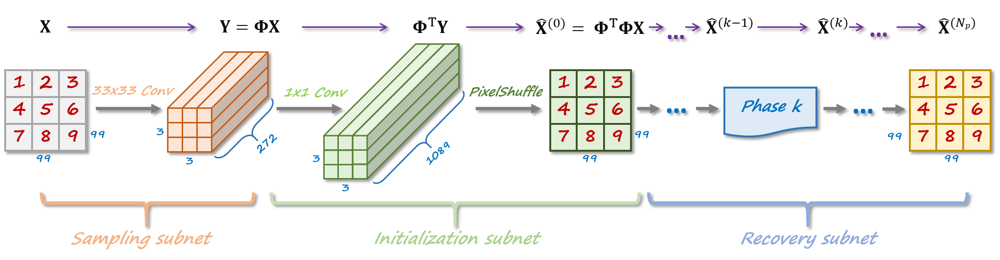
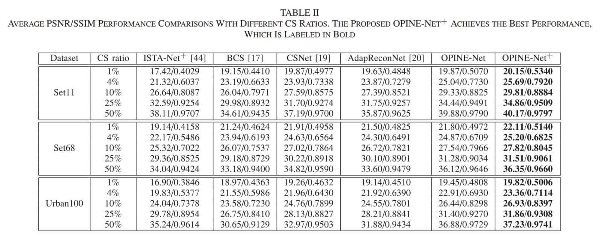
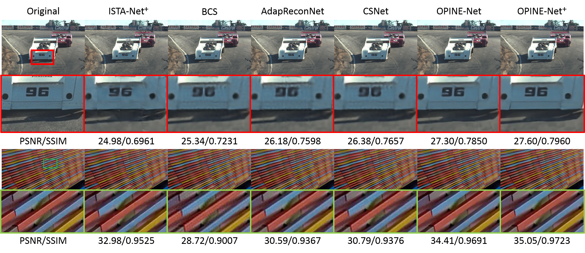

# Optimization-Inspired Compact Deep Compressive Sensing [PyTorch]

This repository is for OPINE-Net<sup>+</sup> introduced in the following paper

[Jian Zhang](http://jianzhang.tech/), Chen Zhao, Wen Gao "Optimization-Inspired Compact Deep Compressive Sensing", IEEE Journal of Selected Topics in Signal Processing (JSTSP), vol. 14, no. 4, pp.  765-774, May 2020. [[pdf]](https://jianzhang.tech/papers/JSTSP2020-OPINE-Net.pdf)

The code is built on **PyTorch** and tested on Ubuntu 16.04/18.04 and Windows 10 environment (Python3.x, PyTorch>=0.4) with 1080Ti GPU.

## Introduction
In order to improve CS performance of natural images, in this paper, we propose a novel framework to design an OPtimization-INspired Explicable deep Network, dubbed OPINE-Net, for adaptive sampling and recovery. Both orthogonal and binary constraints of sampling matrix are incorporated into OPINE-Net simultaneously. In particular, OPINE-Net is composed of three subnets: sampling subnet, initialization subnet and recovery subnet, and all the parameters in OPINE-Net (\eg sampling matrix, nonlinear transforms, shrinkage threshold) are learned end-to-end, rather than hand-crafted. Moreover, considering the relationship among neighboring blocks, an enhanced version OPINE-Net<sup>+</sup> is developed,  which allows image blocks to be sampled independently but reconstructed jointly to further enhance the performance. In addition, some interesting findings of learned sampling matrix are presented. Compared with existing state-of-the-art network-based CS methods, the proposed hardware-friendly OPINE-Nets not only achieve better performance but also require much fewer parameters and much less storage space, while maintaining a real-time running speed.


Figure 1. Illustration of the proposed OPINE-Net<sup>+</sup> framework.


## Contents
1. [Test-CS](#test-cs)
2. [Train-CS](#train-cs)
5. [Results](#results)
6. [Citation](#citation)
7. [Acknowledgements](#acknowledgements)


## Test-CS
### Quick start
1. All models for our paper have been put in './model'.

2. Run the following scripts to test OPINE-Net<sup>+</sup> model.

    **You can use scripts in file 'TEST_OPINE_Net_plus_scripts.sh' to produce results for our paper.**

    ```bash
    # test scripts
    python TEST_CS_OPINE_Net_plus.py  --cs_ratio 1 --layer_num 9
    python TEST_CS_OPINE_Net_plus.py  --cs_ratio 4 --layer_num 9
    python TEST_CS_OPINE_Net_plus.py  --cs_ratio 10 --layer_num 9
    python TEST_CS_OPINE_Net_plus.py  --cs_ratio 25 --layer_num 9
    python TEST_CS_OPINE_Net_plus.py  --cs_ratio 50 --layer_num 9
    ```
    

### The whole test pipeline
1. Prepare test data.

    The original test set11 is in './data'

2. Run the test scripts. 

    See **Quick start**
3. Check the results in './result'.


## Train-CS
### Prepare training data  

1. Trainding data (**Training_Data.mat** including 88912 image blocks) is in './data'. If not, please download it from [GoogleDrive](https://drive.google.com/file/d/14CKidNsC795vPfxFDXa1FH9QuNJKE3cp/view?usp=sharing) or [BaiduPan [code: xy52]](https://pan.baidu.com/s/1X3pERjCD37YdqQuzKNXejA).

2. Place **Training_Data.mat** in './data' directory

### Begin to train


1. run the following scripts to train .

    **You can use scripts in file 'Train_OPINE_Net_plus_scripts.sh' to train models for our paper.**

    ```bash
    # CS ratio 1, 4, 10, 25, 30, 40, 50
    # train scripts
    python Train_CS_OPINE_Net_plus.py --cs_ratio 25 --layer_num 9 --learning_rate 1e-4 --start_epoch 0   --end_epoch 160 --gpu_list 0
    python Train_CS_OPINE_Net_plus.py --cs_ratio 25 --layer_num 9 --learning_rate 1e-5 --start_epoch 160 --end_epoch 170 --gpu_list 0 --save_interval 1
    ```
    
    
    

## Results

### Quantitative Results



### Visual Results



## Citation
If you find the code helpful in your resarch or work, please cite the following papers.
```
@article{zhang2020optimization,
  title={Optimization-Inspired Compact Deep Compressive Sensing},
  author={Zhang, Jian and Zhao, Chen and Gao, Wen},
  journal={IEEE Journal of Selected Topics in Signal Processing},
  volume = {14},
  number = {4},
  pages = {765--774},
  year = {2020}
}
```
## Acknowledgements